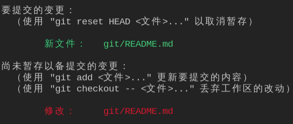
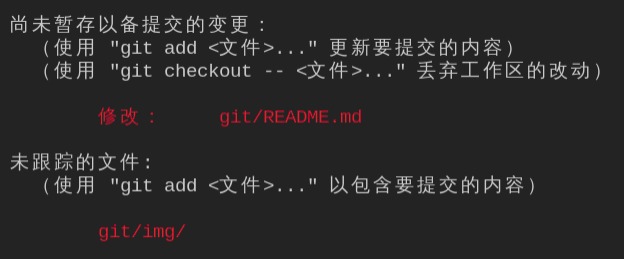
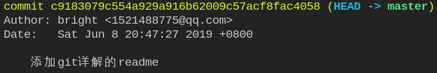

# 深入git生命周期
这篇文章适用于了解git基本的命令，会使用git add，git commit，git pull，git push进行版本管理，希望能深入了解git的版本控制细节的开发者。如果还没有掌握基础，请参考[git基础](https://git-scm.com/book/zh/v2/Git-%E5%9F%BA%E7%A1%80-%E8%8E%B7%E5%8F%96-Git-%E4%BB%93%E5%BA%93)。

这篇文章包括git中的文件状态，工作区，暂存区等的概念，以及深入版本回退。你会了解到git add,git commit在git中代表着什么，了解git reset、git checkout如何工作。

了解这些细节一定能够帮助我们在工作中对项目的版本控制更加如鱼得水。

## 核心概念
git中有两个核心概念：1、三区：工作区、暂存区、git仓库；2、四态：未追踪（untracked）、未更改（unmodified）、已更改（modified）、暂存（staged）。其中工作区就是你的当前项目文件夹，工作区中的文件在git中可能是上面四种状态。使用git add命令添加的文件会被添加到暂存区中。git commit会将暂存区中的文件添加到git仓库中。

所以我们可以这样理解：
* 三区是物理磁盘上的概念，工作区、暂存区、git仓库在git项目目录下都对应着不同的文件/文件夹，通过工作区的代码通过add可以改变暂存区中的文件，暂存区通过commit可以修改git仓库中的文件，git仓库通过版本回退等也可以改变工作区的文件，三个目录可以相互影响。
* 而我们项目管理的文件有上面四种状态，通过git命令可以改变我们管理的文件的状态。

所以三区其实是四态的物理体现。当使用git add [file]时，file的状态变为暂存，此时暂存区的文件会被修改，暂存的状态保存在暂存区的文件中。

接下来对git中的这几种状态进行深入的学习和实践，希望能够深入理解git中原理。能够深入git的版本控制，包括分支（branch）、提交（commit）、重置（reset）等的原理和流程，在工作中能够更加深入地控制项目的版本。

三区的状态转移图：

四态的状态转移图：

接下来我们详细分析在git中的状态转移的命令和细节。**下面的内容对照着这张图可以更好的理解**

## 基本的git流程细节
### 从新建git仓库开始
在一个文件夹下使用git init可以将在该文件夹下创建一个git仓库（使用--bare选项新建一个空的仓库，该仓库不带工作区和暂存区，也就是看不见源代码，用于git服务器）。新建的git仓库没有任何的提交记录。

然后我们在目录下创建文件，比如README.md，使用git status（git status查看当前工作目录下文件的状态），这时README.md的状态是未追踪（untracked）。

### 添加到暂存区
使用git add README.md将README.md添加到暂存区中，这时使用git status查看状态，README.md的状态是staged。

这时候如果我们修改README.md呢？如图：

修改README.md后，我们发现文件状态有两种，怎么回事呢？其实当前文件的状态是modified。暂存区中的是我们刚刚add时的文件的快照。暂存区中的文件等待commit。如果希望保留新修改的内容，需要再次add，将最新的文件添加到暂存区。

### commit到git仓库
commit的时候是从暂存区取的，如果不太明白请看看文章开头所说的三区和四态的概念。

执行git commit过后处于暂存区的文件的状态会变成unmodified。

接着上面的问题，如果add了之后没有commit，又修改了，这时commit会发生什么？commit后执行git status如下图：

暂存区中已经被提交了，但是未暂存的没有提交到git仓库中，仍然为修改或者未跟踪。那为什么commit过后，仍然会保留“修改”、“未跟踪”这些信息呢？commit的是暂存区中的文件，是否修改或者是否跟踪是根据git仓库中的文件版本和当前工作区中的文件版本来确定的。

实际上每一个文件都是相互独立的，可以独立add，commit，互不干扰。这种特性有什么用呢？比如我现在在一个项目中有很多个需求在同时做，做了一个需求，但是另一个改了还没做完，这时候是一起add了commit还是只commit做完了的需求呢？当然是只commit做完了需求了，不然下一次怎么知道上一次改了那些文件，改了什么，做到那儿了呢？当然可以自己记下来，但是如果有多个项目，每个项目又有好几个需求呢？

### 撤销追踪、修改、暂存以及重命名
接下来问题又来了，我想撤销追踪、修改和暂存怎么办呢？提示：对应的指令的参数细节可以使用git 命令 -h/--help来查看，-h是简略版，--help是详细版。例：
> git checkout -h/--help

#### 撤销追踪
使用git rm命令可以撤销追踪，但是要注意，git rm默认不仅会撤销追踪，还会从磁盘中删除这个文件，如果不想删除文件，可以使用--cached选项。
> git rm --cached

#### 撤销修改
使用git checkout [file]可以撤销对文件的修改，回到上一次commit时的状态，即状态图中的unmodified状态。
> git checkout README.md

#### 撤销暂存
使用git reset命令可以撤销暂存，原理是将HEAD移动到指定commit记录（默认是HEAD），然后用这一次记录重置暂存区。

git reset默认只会修改HEAD和暂存区，不会修改工作区中的内容，如果要替换工作区中的内容，使用--hard选项。

> git reset [commit]

commit可以通过git log得到，commit后面的hash就是:

#### 重命名/移动工作目录下的文件
如果我们直接修改工作目录中的文件名，那么在git中的状态是删除了一个文件又新增了一个文件。git提供了命令来执行类似的操作：
> git mv path1 path2

如果path1=path2，则为重命名。修改会被直接保存到暂存区中。

## 版本回退
上面所列举的所有操作可以用下面的这一张图来概括：
